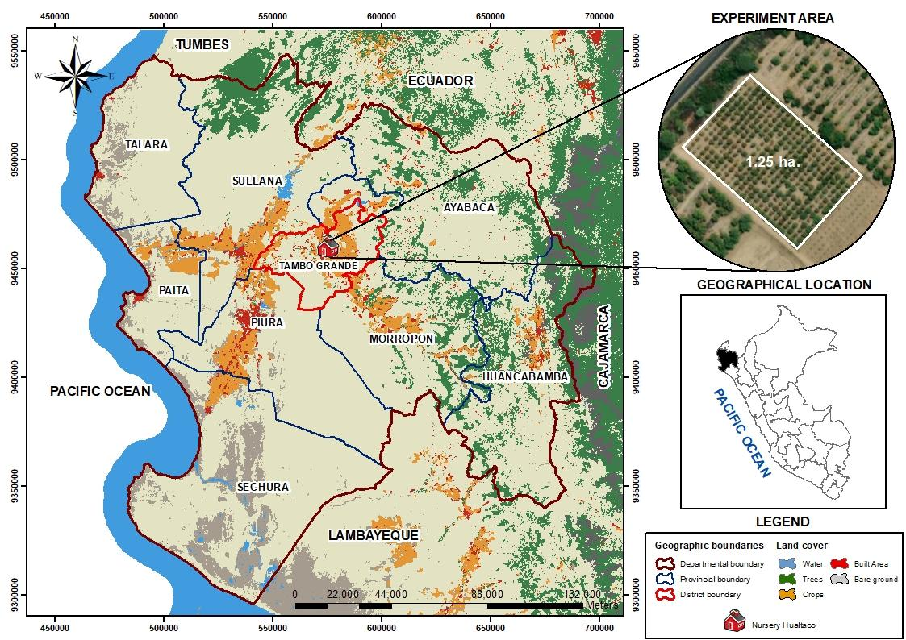
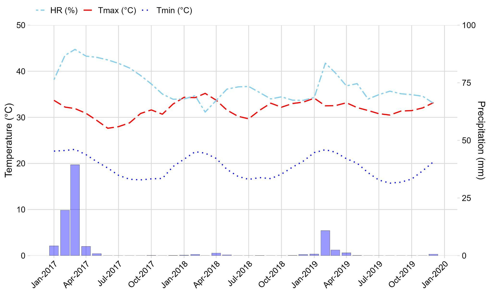

---

**Impact of Interstock and Rootstock on the Growth and Productivity of Mango (*Mangifera indica* L.) in the San Lorenzo Valley, Peru**

Sebastian Casas-Niño^1,2^; Sandy Vilchez-Navarro^1,3^; Henry Morocho-Romero^1,3^; Gabriela Cárdenas-Huamán^1,2^; Esdwin-Oberti Nuñez-Ticliahunca^1,3^; Ana Montañez-Artica^1^; Leslie Velarde-Apaza^1^; Max Ramirez Rojas^1^; Juan Carlos Rojas^1^; Flavio Lozano-Isla^1,4\*^.

*^1^ Dirección de Servicios Estratégicos Agrarios - Estación Experimental Agraria El Chira, Instituto Nacional de Innovación Agraria (INIA), Piura 20120, Perú.*

*^2^ Universidad Nacional Agraria La Molina (UNALM), Lima, Perú.*

*^3^ Universidad Nacional de Piura, Campus Universitario s/n. Urb. Miraflores. Piura, Perú.*

*^4^ Facultad de Ingeniería y Ciencias Agrarias, Universidad Nacional Toribio Rodríguez de Mendoza de Amazonas (UNTRM), Amazonas 01001, Perú.*

* ^\*^ *Corresponding author: [20140231@lamolina.edu.pe](mailto:20140231@lamolina.edu.pe); [flavio.lozano@untrm.edu.pe](mailto:flavio.lozano@untrm.edu.pe) 

ORCID IDs:

Sebastian Casas-Niño: [0000-0002-6576-8761](https://orcid.org/0000-0002-6576-8761)

Sandy Vilchez-Navarro: [0009-0002-1784-5563](https://orcid.org/0009-0002-1784-5563)

Henry Morocho-Romero: [0000-0002-1520-2372](https://orcid.org/0000-0002-1520-2372)

Gabriela Cárdenas-Huamán: [0000-0002-8379-5464](https://orcid.org/0000-0002-8379-5464) 

Edwin-Oberti Nuñez-Ticliahuanca: [0009-0004-4613-0625](https://orcid.org/0009-0004-4613-0625)

Ana-Gabriela Montañez-Artica: [0000-0003-3580-6621](https://orcid.org/0000-0003-3580-6621)

Leslie Diana Velarde-Apaza: [0000-0001-6031-6355](https://orcid.org/0000-0001-6031-6355) 

Max Ramirez Rojas: [0000-0003-3322-0838 ](https://orcid.org/0000-0003-3322-0838)	

Juan Carlos Rojas: [0000-0001-7538-2275](https://orcid.org/0000-0001-7538-2275) 

Flavio Lozano-Isla: [0000-0002-0714-669X](https://orcid.org/0000-0002-0714-669X)


# **ABSTRACT**

Mango (*Mangifera indica* L.) is a tropical fruit tree characterized by vigorous growth and high fruit production, making it one of Peru’s main export crops. However, its extensive vegetative development requires substantial space, limiting productivity per unit area. This study evaluated the effects of rootstock and interstock combinations on agronomic traits and fruit quality. A total of 216 trees were established using ‘Chulucanas’ and ‘Chato’ as rootstocks and ‘Chulucanas,’ ‘Chato,’ ‘Irwin,’ and ‘Julie’ as interstocks, with a spacing of 6.0 m × 6.0 m. Tree performance was assessed after 10 years during the 2017–2019 growing seasons in Piura, Peru. The experiment followed a randomized complete block design (RCBD) with a 2 × 4 factorial arrangement and three blocks. The first factor corresponded to rootstock varieties, while the second factor included interstock varieties.

The results indicated that the combination of the ‘Chulucanas’ rootstock with ‘Chulucanas’ and ‘Julie’ interstocks reduced tree height by 10.94% and 11.70%, respectively. Additionally, significant differences in fruit production were observed among growing seasons, with 2017 exhibiting a 15% lower yield compared to 2018 and 2019. However, fruit quality parameters remained unaffected by rootstock–interstock combinations. These findings suggest that cultivar selection plays a critical role in modulating tree growth, while environmental conditions or season-specific factors may influence yield variability.

**Keywords:** agronomic performance; biometric characteristics; fruit yield; grafting techniques; El Niño phenomena

# **INTRODUCTION** 

Mango (Mangifera indica L.) is a fruit tree from the Anacardiaceae family, cultivated in tropical and subtropical regions [[1]](https://www.zotero.org/google-docs/?8y0d98). Its global production is estimated at approximately 51 million tons [[2]](https://www.zotero.org/google-docs/?RPY5zW). In Peru, national production reached 378 thousand tons in 2024 [[3]](https://www.zotero.org/google-docs/?SN5q39). It is characterized by vigorous growth and attractive fruits, with high levels of carbohydrates, fatty acids, minerals, and vitamins [[4]](https://www.zotero.org/google-docs/?mhgNqc). The inflorescence is a branched terminal panicle, ranging from 10 to 60 cm in length, bearing between 500 and 10,000 flowers per panicle [[5]](https://www.zotero.org/google-docs/?yc4QWJ). The fruit is a large, fleshy drupe with an edible mesocarp of variable thickness [[6]](https://www.zotero.org/google-docs/?9p1pGl). Mango trees can be propagated both sexually and asexually. Although techniques such as air layering, cuttings, and micropropagation have been used, most commercial plantations are established through grafting or budding, using polyembryonic rootstocks for their genetic uniformity [[7]](https://www.zotero.org/google-docs/?FaGIoR). Currently, mango cultivation is managed at low to medium planting densities, ranging from 69 to 416 trees per hectare, due to the space required for vegetative growth, which is commonly associated with fruit production [[8,9]](https://www.zotero.org/google-docs/?sZwz9H).

The use of low densities decreases production because yields during the first few years are low [[10]](https://www.zotero.org/google-docs/?eQm4FP). However, increasing densities along with the vegetative growth of the crop reduces profits, as they complicate cultural maintenance tasks [[9]](https://www.zotero.org/google-docs/?P28PfL). Additionally, a tall canopy results in a lower number of trees per unit area, causing competition for light and aeration [[11]](https://www.zotero.org/google-docs/?j6H6Qf). The application of growth regulators,   pruning techniques,   and the genetics of rootstocks and scions should be investigated in this context to control tree vigor [[12]](https://www.zotero.org/google-docs/?0dM103).

Using rootstocks is a common method of propagating fruit trees that involves fusing the root system (rootstock)  with the aerial part (interstock). These parts combine through assembly to form a new plant [[13,14]](https://www.zotero.org/google-docs/?xXNn4C). Tree vigor, yield, fruit quality, and tolerance to biotic or abiotic stress are all related to rootstock selection [[15,16]](https://www.zotero.org/google-docs/?zrvRMt). The propagation of highly valuable varieties occurs on grafts that exhibit greater resistance to diseases, better adaptability to environmental conditions, and optimized nutrient absorption [[17,18]](https://www.zotero.org/google-docs/?GeWA0q). The viability and compatibility of the graft are influenced by the proximity between taxonomic species and the technique used to align the vascular bundles, which ensures the translocation of carbohydrates and hormones and nutrient transport [[19]](https://www.zotero.org/google-docs/?36UPcK).

While mango production is correlated with tree size [[9]](https://www.zotero.org/google-docs/?cY3KZk), cultivars such as ‘Irwin’ [[20]](https://www.zotero.org/google-docs/?qlVADe), ‘Keitt’ [[21]](https://www.zotero.org/google-docs/?nZctDZ), and ‘Tommy Atkins’ [[22]](https://www.zotero.org/google-docs/?JRTjrL) present high yields in smaller trees. These latter varieties would be suitable for planting at high densities [[9,23]](https://www.zotero.org/google-docs/?fZqmTJ).

In this context, owing to the regulation of the vertical or horizontal growth of the tree and the modification of the sensory properties of the fruit caused by rootstock-interstock combinations in mango varieties [[24,25]](https://www.zotero.org/google-docs/?XyJ6hR), this study aims to determine the effects of the interaction between rootstock and interstock on the agronomic characteristics and fruit biometrics of the mango cultivar.

# **MATERIALS AND METHODS**

##  Study Area

The study was conducted during the agricultural seasons of 2017-2019 at the Hualtaco Nursery, owned by the El Chira Agricultural Experimental Station (EEA), located in the district of Tambogrande, Piura Department, at a latitude of 4° 55' 53" South, a longitude of 80° 20' 22" West, and an altitude of 82 m above sea level. The area has a tropical desert and subtropical climate. The mango (*Mangifera indica* L.) plants are spaced at 6.0 m × 6.0 m, with a total of 216 plants.

{#fig:id.gfbcca5a1f5w}


## Plant Material

The rootstocks were obtained from seeds of ‘Chulucanas’ and ‘Chato’ mangoes propagated in seedbeds with agricultural soil. Afterward, the plants were transplanted into polyethylene bags (16"×8”) filled with forest agricultural soil substrate. For the interstocks, vegetative buds from ‘Chulucanas’, ‘Chato’, ‘Irwin’, and ‘Julie’ were used, whereas vegetative buds from ‘Kent’ were used for top grafting. The seeds and vegetative buds were acquired from the germplasm bank located at the Hualtaco nursery of EEA-El Chira. The main characteristics of the plant material used are described below:

**Chulucanas:** This variety is known as a criollo cultivar from Chulucanas in the Piura region, Peru, where the climatic conditions are suitable for its development. This cultivar is widespread in the northern region of the country and is used as rootstock. It produces yellow and uniform fruit, with a uniquely intense flavor, a high amount of fiber around the seed, and a smaller size than the export mango fruit ‘Kent’ [[26]](https://www.zotero.org/google-docs/?bwdAcE).

**Irwin:** Irwin is one of the most commercially produced and consumed cultivars in Japan, Taiwan, South Korea, and Australia and is known as the "apple mango.” ‘Irwin’ plants are small to medium in height, with oval-shaped fruits that have red skin coloration, measuring approximately 11.5 to 13 cm in length and 8 to 9 cm in diameter [[27]](https://www.zotero.org/google-docs/?UkIemE).

**Julie**: This variety is widespread in Nigeria. The plants exhibit an extended growth habit, with medium foliage density and lanceolate-shaped leaves; the fruit is ovoid with yellow skin coloration, measuring approximately 99.5 mm in length, 70 mm in width, and weighing 219 g [[28]](https://www.zotero.org/google-docs/?I1j1cY).

**Chato:**  Known as the Chato variety from Ica, it is one of the most widely exploited cultivars in the valley of the Ica region in southern Peru. It is characterized by fruit measuring approximately 151 mm in length and 82 mm in width and weighing 291 g  [[29]](https://www.zotero.org/google-docs/?g2MFf4).


| **Treatment**  | **Rootstock**  | **Interstock** | **Scion**       |
|----------------|----------------|----------------|-----------------|
| T1             | Chulucanas     | Chulucanas     | Kent            |
| T2             | Chulucanas     | Chato          | Kent            |
| T3             | Chulucanas     | Julie          | Kent            |
| T4             | Chulucanas     | Irwin          | Kent            |
| T5             | Chato          | Chulucanas     | Kent            |
| T6             | Chato          | Chato          | Kent            |
| T7             | Chato          | Julie          | Kent            |
| T8             | Chato          | Irwin          | Kent            |


: Treatment Coding of the Study: Impact of Interstock and Rootstock on the Vigor and Productive Development of Mango (*Mangifera indica* L.) in the San Lorenzo Valley, Piura, Peru. {#tbl:id.541d1mdcbw1l}

## Agronomic Management

Soil preparation was carried out via a tractor and a harrow, in accordance with the layout of the crop rows, hole digging, and transplanting of seedlings, following a grid planting design of 6 × 6 meters. Seed selection was performed from the mango germplasm bank, which comes from elite plants at the Hualtaco Annex of the El Chira Agricultural Experimental Station (EEA). The process of removing the pericarp, mesocarp, and endocarp facilitated better development of the embryo in the seedlings, which were obtained from polyembryonic seeds in seedbeds. Grafting was performed using the double-tongue technique three months after seedling transplanting into nursery bags. Subsequently, interstock and apical grafting were conducted using the same method, known as the English or double-tongue grafting technique. This technique involves making a beveled cut on both the rootstock and the scion, followed by a longitudinal cut (approximately 1 cm deep) along one-third of the beveled surface, creating interlocking tongues on both plant parts [[30]](https://www.zotero.org/google-docs/?rUdcWO). The graft components were then interwoven, secured with grafting tape, and covered with a perforated plastic bag to maintain humidity. There was an eight-month interval between the interstock and apical grafting procedures. Bridge rootstock grafting was performed in 2008, while bud bridge grafting was conducted in 2009.

The irrigation system was established via a technique, starting with one irrigation tape and two microtubes per plant in the first year. A second irrigation tape with two additional microtubes was then added to improve water efficiency. The irrigation schedule was programmed with a frequency of 15-20 days and adjusted according to the crop's needs. Fertilization was carried out through the combined application of organic fertilizers and synthetic fertilizers, in accordance with the nutritional requirements of the mango at each stage of its development. Weeding was performed periodically via brush cutters, depending on the emergence of weeds in the field. Phytosanitary control was managed under a constant monitoring scheme and integrated pest management. Finally, activities related to flowering, fruiting, and harvesting followed the traditional agronomic practices of local producers in the San Lorenzo Valley.

## Agronomic and Biometric Characterization of the Fruit

The agronomic characterization included the evaluation of plant height, fruit number, and budburst and flowering percentages. For this, all the plants in the experiment were selected, and the mentioned variables were recorded.

The plant height (m) was determined at the end of the experiment. It was measured from the base of the soil to the apex of the plant via a graduated wooden ruler. The number of fruits per plant was determined at the end of each growing season through a direct visual count. The total number of fruits produced by each individual was recorded before the first harvest. The budburst percentage (%) was determined in the final phase of the experiment through direct observation. Six branches from the middle third of the canopy on the east side and six branches on the west side of each plant were selected and monitored. The number of shoots produced by each branch and the number of buds until desiccation were evaluated [[31]](https://www.zotero.org/google-docs/?vyWEMy). The flowering percentage (%) was evaluated at the end of each growing season through visual observation, recording the intensity of flowering in the tree canopy during anthesis. The canopy was divided into two opposing sections, and the percentage of flowering was recorded on a scale of 0-100 according to the coverage of the inflorescences in each section. To calculate the overall flowering percentage of the tree, an average of both evaluated sections was taken [[32]](https://www.zotero.org/google-docs/?Kig1Uf).

For the evaluation of fruit biometrics, six individuals per treatment were randomly selected, and five fruits were collected from each at harvest, resulting in a total of 30 fruits per treatment. Fruits that reached physiological maturity were chosen for measurements using a vernier caliper and a balance. Each fruit was measured for weight (g), length (mm), and diameter (mm) [[33]](https://www.zotero.org/google-docs/?YKSeQ9).

## Experimental Design

The experiment was conducted via a randomized complete block design (RCBD) with a 2 × 4 factorial arrangement consisting of three blocks. The first factor corresponded to the rootstock, with two levels: ‘Chulucanas’ and ‘Chato’. The second factor was the interstock, with four levels: ‘Chulucanas’, ‘Chato’, ‘Irwin’, and ‘Julie’. Each experimental unit consisted of nine mango plants, totaling 216 evaluated plants. The treatments resulted from the interaction between the rootstock, interstock, and the scion graft of the ‘Kent’. To determine the agronomic characteristics, all the plants were selected, and the variables measured included plant height, percentage of budding, number of fruits, and percentage of flowering. For the determination of fruit biometrics, five plants were randomly selected, and the variables measured included the weight, length, and diameter of the fruits.

## Statistical Analysis

Statistical analyses were conducted using R software version 4.4.1 [[34]](https://www.zotero.org/google-docs/?wbH9wh). A linear mixed-effects model was fitted to assess treatment effects, providing robustness against potential violations of normality and homoscedasticity assumptions [[35]](https://www.zotero.org/google-docs/?bxSsnV). Analysis of variance (ANOVA) was applied to the fitted models, and mean comparisons were performed using Tukey’s honest significant difference (HSD) test at a significance level of α = 0.05, using the emmeans package [[36]](https://www.zotero.org/google-docs/?qYbHBZ). Multivariate relationships among variables were explored through principal component analysis (PCA) with the FactoMineR package [[37]](https://www.zotero.org/google-docs/?g1qPxF). Variable correlations derived from the PCA were visualized using the corrplot package [[38]](https://www.zotero.org/google-docs/?ntRZ3e).


# **RESULTS**

## Weather conditions

To determine the weather conditions that influenced the management of mango cultivation during the agricultural seasons of 2017–2019, a graph was created with data on maximum temperature, minimum temperature, precipitation, and relative humidity obtained from the “El Partidor” weather station of SENAMHI.

The highest temperature values were recorded in 2018 from January to March, reaching a peak of 35.20 °C in March. On the other hand, the lowest temperature values were observed in 2019 from July to November, reaching 15.72 °C in August. In terms of precipitation, the highest values occurred in 2017 during February and March, peaking at 39.41 mm in March. This was an atypical event caused by the El Niño‒Southern Oscillation (ENSO) climate phenomenon. The relative humidity was also influenced by this event, with a maximum value of 89.48% occurring in March 2017. These parameters are important because they are critical factors that directly influence the growth, flowering, fruiting, and quality of mango fruit.

{#fig:id.xfyxxwypvusw}


## Agronomic Characterization

To determine the agronomic characteristics of the rootstock-interstock interaction in the mango, the variables measured included plant height, number of fruits, and percentages of budding and flowering. A univariate analysis was performed via Tukey's mean comparison test (p < 0.05) to assess whether there were significant differences between the rootstock and the interstock used ([Figure  @fig:id.1lhpgrqadiq1]:). This study aimed to identify the rootstock-interstock relationship that exhibits the most favorable agronomic characteristics for enhancing the production and agronomic management of mango (*Mangifera indica* L.) in San Lorenzo Valley.


![Agronomic characteristics of the rootstock and interstock relationship for mango in the Piura Region, calculated based on nine plants per treatment: Plant height at harvest (a), percentage of sproud (b), number of fruits produced during the agricultural seasons from 2017 to 2019 (c), percentage of flowering recorded during the agricultural seasons of 2017-2019 (d). Data are expressed as mean ± standard error. Different uppercase letters denote statistically significant differences between rootstock, while lowercase letters indicate differences interstock treatments (a-b). Different uppercase letters denote statistically significant differences between years, while lowercase letters indicate differences interstock treatments (c-d). Mean comparison was according to Tukey’s test (p < 0.05, n = 648).](img_2.jpg){#fig:id.1lhpgrqadiq1}


For the plant height variable, significant differences were observed in the interaction between rootstock and interstock (p-value < 0.01). In particular, the use of the ‘Chulucanas’ rootstock in combination with ‘Chulucanas’ and ‘Julie’ interstocks showed significant differences compared to the ‘Chulucanas’ – ‘Chato’ combination. Grafted plants with ‘Chulucanas’ – ‘Chulucanas’ and ‘Chulucanas’ – ‘Julie’ reached average heights of 3.50 m and 3.47 m, respectively, while ‘Chulucanas’ – ‘Chato’ recorded a height of 3.93 m, indicating a reduction of 10.94% and 11.70%, respectively, compared to ‘Chato’ interstock. However, ‘Chato’ rootstock did not show significant differences in plant height when associated with the different interstocks evaluated.  

On the other hand, when comparing the effects of rootstocks for the same interstock, significant differences were found. Specifically, ‘Chato’ – ‘Irwin’ combination had an average height of 3.92 m, whereas ‘Chulucanas’ – ‘Irwin’ reached 3.65 m, representing a 6.89% reduction. Similarly, ‘Chato’ – ‘Julie’ combination showed an average height of 3.86 m, while ‘Chulucanas’ – ‘Julie’ recorded 3.47 m, which corresponds to a 10.10% reduction ([Figure 3](?tab=t.0#bookmark=id.1lhpgrqadiq1)a).

No significant differences were observed in the sprouting percentage among the different interstocks within each rootstock (p-value > 0.05). However, when comparing the effect of rootstocks for the same interstock, significant differences were found. Specifically, ‘Chulucanas’ – ‘Chato’ combination exhibited a higher sprouting percentage (70.6%) compared to ‘Chato’ – ‘Chato’ (54.8%). Similarly, ‘Chulucanas’ – ‘Julie’ association showed a higher sprouting percentage (72.2%) compared to ‘Chato’ – ‘Julie’ (51.9%), highlighting the impact of rootstock on sprout induction ([Figure 3](?tab=t.0#bookmark=id.1lhpgrqadiq1)b).

For the variable number of fruits, no significant differences were observed among the different interstocks within each rootstock in the same year (p-value = 0.46). However, significant differences were found between the evaluated agricultural seasons (p-value < 0.001), indicating interannual variability in fruit production ([Figure 3](?tab=t.0#bookmark=id.1lhpgrqadiq1)c).

In particular, the 2017 agricultural season recorded a lower average number of fruits compared to the 2018 and 2019 seasons. Among these differences, ‘Chato’ – ‘Julie’ combination stood out, with an average of 173 fruits in 2017, while in 2018 and 2019, it reached 208 and 205 fruits, respectively, representing an approximate reduction of 16% compared to the following years. Similarly, in ‘Chulucanas’ – ‘Julie’ combination had a lower average number of fruits in 2017, with 177 fruits, in contrast to the averages observed in 2018 and 2019, with 211 and 208 fruits, respectively, representing an approximate reduction of 15%. ([Figure 3](?tab=t.0#bookmark=id.1lhpgrqadiq1)c).

For the variable flowering percentage, significant differences were observed among the different interstocks within each rootstock in the same year (p < 0.05). In the case of the ‘Chato’ rootstock, its association with the ‘Chulucanas’ interstock exhibited a higher flowering percentage across all agricultural seasons compared to its association with the ‘Chato’ and ‘Julie’ interstocks. Conversely, the ‘Chulucanas’ rootstock, when combined with the ‘Chato’ interstock, showed a lower flowering percentage in all agricultural seasons compared to its combination with the other interstocks ([Figure 3](?tab=t.0#bookmark=id.1lhpgrqadiq1)d).

Furthermore, significant differences were found between the evaluated agricultural seasons (p < 0.001), indicating interannual variability in flowering. Specifically, the 2018 agricultural season recorded a lower average flowering percentage compared to the 2017 and 2019 seasons. Among these differences, the ‘Chato’ – ‘Irwin’ combination stood out, registering an average flowering percentage of 68.9% in 2018, while in 2017 and 2019, it reached 81%. Similarly, the ‘Chulucanas’ – ‘Irwin’ combination showed an average flowering percentage of 74.6% in 2018, in contrast to the 86.7% observed in 2017 and 2019. ([Figure 3](?tab=t.0#bookmark=id.1lhpgrqadiq1)d).


```Unknown element type at this position: UNSUPPORTED```To analyze the association between variables and individuals, a multivariate analysis of principal components (PCA) and a Pearson correlation analysis were conducted  ([Figure  @fig:id.r1ur4b6nanx4]:).

![Principal component analysis (PCA) of the agronomic characteristics in mango cultivation based on the use of rootstock-interstock combinations. Variables were evaluated to determine the agronomic characteristics of the rootstock-interstock combination in mango (a). Treatments were used based on the rootstock-interstock combination for evaluating the agronomic characteristics of mango plants (b). Percentage of variance explained by each dimension and contribution of the studied variables to dimensions (c). Correlations between the studied variables and the dimensions explaining the variance (d). The analysis was based on 648 observations (n = 648).](img_3.jpg){#fig:id.r1ur4b6nanx4}


```Unknown element type at this position: UNSUPPORTED```The first two components represent 85.52% of the cumulative variance, accounting for 62.27% of the variance in dimension 1 and 23.26% in dimension 2 ([Figure 4](?tab=t.0#bookmark=id.r1ur4b6nanx4)a, c). For dimension 1, the variables plant height and percentage of flowering contributed 33.26% and 29.71%, respectively, whereas the percentage of budding contributed 23.77% and the number of fruits contributed 13.26% [Figure 4](?tab=t.0#bookmark=id.r1ur4b6nanx4)a, c). In dimension 2, the variable number of fruits and percentage of buds had the greatest contributions, at 66.19% and 33.05%, respectively, whereas the percentage of flowers was 0.23% and plant height was 0.53%. ([Figure 4](?tab=t.0#bookmark=id.r1ur4b6nanx4)a, c).

The vectors indicate the direction of the relationship between the variables, showing a positive relationship among the variables of budding, flowering, and number of fruits produced, in contrast to plant height, where a negative relationship is observed. Notably, there was a strong positive correlation r = 0.86 between the percentage of flowering and a strong negative correlation r = -0.91 between the plant height variable and dimension 1. Furthermore, in dimension 2, the variable number of fruits had a strong positive correlation of r = 0.78 ([Figure 4](?tab=t.0#bookmark=id.r1ur4b6nanx4)a, d).

On the other hand, it is observed that ‘Chulucanas’-‘Chulucanas’ rootstock-interstock relationship is aligned with the vector for the number of fruits, indicating that individuals with this graft presented better characteristics for this variable. In terms of the percentage of budding, individuals with ‘Chulucanas’-‘Julie’ and ‘Chato’-‘Chulucanas’ relationships presented the highest values for this variable. In terms of the percentage of flowers, ‘Chato’-‘Chulucanas’ rootstock-interstock relationship presented the best characteristics. For plant height, ‘Chato’-’Julie’ and ‘Chato’-‘Irwin’ relationships presented the highest values ([Figure 4](?tab=t.0#bookmark=id.r1ur4b6nanx4)b).


```Unknown element type at this position: UNSUPPORTED```## Biometric characterization of the fruit

To determine the biometrics of the fruit produced by the rootstock-interstock interaction in the mango, the variables of weight, length, and diameter of the fruit were evaluated. Tukey's mean comparison test (p < 0.05) was conducted to assess whether there were significant differences between the rootstock and the interstock used ([Table  @tbl:id.541d1mdcbw1l]:). This study aimed to identify the rootstock-interstock relationship that produces the best quality mango fruit (*Mangifera indica* L.) in San Lorenzo Valley.

```Unknown element type at this position: UNSUPPORTED```


| **Variable**        | **Rootstock**       | **Interstock**      | **mean**            | **sd**              | **min**             | **max**              |
|---------------------|---------------------|---------------------|---------------------|---------------------|---------------------|----------------------|
| Fruit Weight (g)    | Chato               | Chato               | 452.53              | 79.92               | 305                 | 639                  |
|                     | Chato               | Chulucanas          | 462.34              | 69.82               | 340                 | 620                  |
|                     | Chato               | Irwin               | 482.03              | 87.3                | 350                 | 700                  |
|                     | Chato               | Julie               | 465.97              | 92.07               | 300                 | 645                  |
|                     | Chulucanas          | Chato               | 484.97              | 101.98              | 316                 | 765                  |
|                     | Chulucanas          | Chulucanas          | 468.17              | 118.73              | 230                 | 665                  |
|                     | Chulucanas          | Irwin               | 447.23              | 70.09               | 310                 | 605                  |
|                     | Chulucanas          | Julie               | 484.7               | 93.46               | 367                 | 717                  |
| Fruit length (mm)   | Chato               | Chato               | 105.97              | 6.78                | 93                  | 120                  |
|                     | Chato               | Chulucanas          | 106.28              | 6.8                 | 94                  | 119                  |
|                     | Chato               | Irwin               | 106.07              | 6.47                | 95                  | 124                  |
|                     | Chato               | Julie               | 107.67              | 7.54                | 91                  | 120                  |
|                     | Chulucanas          | Chato               | 106.53              | 7.21                | 95                  | 123                  |
|                     | Chulucanas          | Chulucanas          | 106.2               | 10.87               | 86                  | 126                  |
|                     | Chulucanas          | Irwin               | 106.43              | 7.28                | 92                  | 122                  |
|                     | Chulucanas          | Julie               | 109.73              | 8.03                | 98                  | 129                  |
| Fruit diameter (mm) | Chato               | Chato               | 85.23               | 4.72                | 76                  | 97.5                 |
|                     | Chato               | Chulucanas          | 86.09               | 3.61                | 78.5                | 93.5                 |
|                     | Chato               | Irwin               | 87.63               | 5.07                | 79.5                | 100                  |
|                     | Chato               | Julie               | 86.23               | 5.56                | 75.5                | 97.5                 |
|                     | Chulucanas          | Chato               | 87.7                | 5.4                 | 78                  | 100.5                |
|                     | Chulucanas          | Chulucanas          | 86.08               | 6.61                | 69.5                | 99                   |
|                     | Chulucanas          | Irwin               | 84.53               | 4.03                | 77.5                | 92.5                 |
|                     | Chulucanas          | Julie               | 86.3                | 4.68                | 79.5                | 97                   |


: Fruit biometrics in eight combinations of rootstock-interstock for mango during the 2023 agricultural season. Sd: standard deviation; min: minimum; max: maximum; Sig: significance. Calculations are based on five fruits evaluated from two plants per treatment. Different letters indicate significant differences in Tukey’s mean comparison test (p < 0.05, n = 240). Comparisons were made among the interstock varieties within each rootstock. {#tbl:id.gu0joegsk6p1}


```Unknown element type at this position: UNSUPPORTED```The statistical analysis performed via Tukey’s post hoc test (α = 0.05) revealed that for the fruit weight variable, nonsignificant differences were found (p-value = 0.19). Similarly, the same occurred with fruit length, where nonsignificant differences were found (p-value = 0.87). Additionally, for fruit diameter, nonsignificant differences were found between the treatments used (p-value = 0.02).

```Unknown element type at this position: UNSUPPORTED```To analyze the association between variables and individuals, a multivariate PCA and a Pearson correlation analysis were conducted ([Figure  @fig:id.rtncwk932bt9]:, Supplementary Figure 2).

![Principal component analysis (PCA) of fruit biometrics in mango cultivation based on the use of rootstock-interstock combinations. Variables were evaluated to determine the fruit quality of the rootstock-interstock combination in mango (a). Treatments were used based on the rootstock-interstock combination for evaluating fruit quality in mango plants (b). Percentage of variance explained by each dimension and contribution of the studied variables to dimensions (c). Correlations between the studied variables and the dimensions explaining the variance (d). The analysis was based on 240 observations (n = 240).](img_4.jpg){#fig:id.rtncwk932bt9}


```Unknown element type at this position: UNSUPPORTED```The first two components represent 99.21% of the cumulative variance, with 66.97% of the variance in dimension 1 and 32.23% in dimension 2 ([Figure 5](?tab=t.0#bookmark=id.rtncwk932bt9)a, c). For dimension 1, the variables weight and diameter of the fruit contributed the most to this dimension, with 49.14% and 40.32%, respectively, whereas the contribution of fruit length was 10.55% ([Figure 5](?tab=t.0#bookmark=id.rtncwk932bt9)a, c). In dimension 2, the variable fruit length had the greatest contribution, at 81.29%, compared with the contributions of weight and fruit diameter, which were 0.07% and 18.64%, respectively ([Figure 5](?tab=t.0#bookmark=id.rtncwk932bt9)a, c)

The vectors indicate the direction of the relationship between the variables, highlighting a notable degree of positive correlation among the weight, length, and diameter of the fruits. Notably, there was a strong positive correlation for fruit weight r = 0.99 and fruit diameter r = 0.90 with respect to dimension 1. Additionally, in dimension 2, the variable fruit length has a strong positive correlation of r = 0.89 ([Figure 5](?tab=t.0#bookmark=id.rtncwk932bt9)a, d).

On the other hand, it is observed that the ‘Chulucanas’-‘Julie’ rootstock-interstock relationship is aligned with the vector for fruit length, indicating that individuals with this graft exhibit better characteristics for this variable. In terms of fruit weight, individuals with the ‘Chulucanas’-‘Chato’ and ‘Chato’-‘Irwin’ relationships presented the highest values. In terms of fruit diameter, the ‘Chulucanas’-‘Chato’ and ‘Chato’-‘Irwin’ rootstock-interstock relationships also presented the highest means ([Figure 5](?tab=t.0#bookmark=id.rtncwk932bt9)b).


```Unknown element type at this position: UNSUPPORTED```# **DISCUSSIONS**

The mango is considered one of the most important export fruits in Peru. Sixty-six point seven percent (66.7%) of the mango harvest is produced in the Piura department, making it the country's leading producer [[29]](https://www.zotero.org/google-docs/?lr71fU). Despite the large quantity of mango produced, there is still low productivity per unit area, which significantly impacts exports. The use of rootstocks influences the growth of mango plants in terms of height, diameter, and canopy volume, potentially inducing dwarfism in individuals and thereby increasing the planting density per hectare [[39]](https://www.zotero.org/google-docs/?Yc7pkz). This research evaluated the effects of rootstock and interstock on the agronomic characteristics and fruit quality of mango. The growth and productivity parameters that determine the production of mango in the San Lorenzo Valley, Piura, were assessed.

The interaction between rootstocks and interstocks plays a very important role in the process of obtaining crops with favorable agronomic characteristics [[40–42]](https://www.zotero.org/google-docs/?6SNmeX). In our study, we evaluated the impact of interstocks and observed that the interaction influenced plant height ([Figure  @fig:id.1lhpgrqadiq1]:, [Figure  @fig:id.r1ur4b6nanx4]:). The interaction of ‘Chulucanas’ rootstock with the interstocks ‘Chulucanas’, ‘Irwin’, and ‘Julie’ resulted in a reduction in height. One possible factor explaining this decrease may be the size of the cultivars used, as is the case with ‘Irwin’, which produces plants with shorter heights [[27]](https://www.zotero.org/google-docs/?toeyco). Our results agree with those of the study by  Minja et al. [[40]](https://www.zotero.org/google-docs/?Mn1wG1), which evaluated three types of rootstocks (‘Ngwangwa’, ‘Sindano’, and ‘Zinzi’) in six improved mango cultivars (‘Manzano’, ‘Ngowe’, ‘Kent’, ‘Keitt’, ‘Alphonso’, and ‘Tommy Atkins’). The authors mention that growth is influenced by the type of rootstock and the cultivar of the scion or graft used. Similarly, this aligns with the findings [[41]](https://www.zotero.org/google-docs/?rPXr8B), who evaluated four grafts (‘Keitt’, ‘Naomi’, ‘Osten’, and ‘Shelly’) on three rootstocks (‘Sukkary’, ‘Zebda’, and ‘4/9’) during two successive seasons in 2021 and 2022; their results showed that the grafts had a significant influence on growth parameters.

On the other hand, in our study, the sprouting percentage was not influenced by the interstocks but was significantly affected by the rootstock. These findings contrast with those reported by Hamza  [[42]](https://www.zotero.org/google-docs/?AF28eW), who evaluated three scion varieties (‘Sinddhri,’ ‘Sufaid Chaunsa,’ and ‘Chenab Gold’) grafted at three different heights. Their results indicated that scion variety significantly increased the number of sprouts produced. This difference may be attributed to the genetic variability among scion cultivars, as sprouting intensity in mango can vary considerably due to genetic factors [[43]](https://www.zotero.org/google-docs/?r5vTNC). Therefore, it is presumed that the graft varieties used in their study exhibit greater genetic divergence than those employed in the present research. For flowering and fruit production, our results were primarily influenced by the agricultural season, with significant differences observed across the evaluated years. This suggests that environmental conditions or campaign-specific factors may have played a key role in mango productivity, regardless of the rootstock and interstock used. These differences may be due to changes in climate caused by the El Niño-Southern Oscillation (ENSO) phenomenon. As noted by Scuderi [[44]](https://www.zotero.org/google-docs/?93miPq), environmental factors can influence the development of flowering and, consequently, the number of fruits produced during mango cultivation.

Rebolledo-Martinez [[45]](https://www.zotero.org/google-docs/?SpZeHj) evaluated the grafting of the ‘Manila’ mango on short (‘Thomas’ and ‘Julie’), medium (‘Esmeralda’, ‘Irwin Morado’, ‘Gomera 1’, and ‘Chauza’), and tall (‘Creole’) rootstocks. Their results revealed that the ‘Julie’ rootstock had a positive effect on height, stem diameter, and fruit production. In our study, the interaction of rootstocks and interstocks influenced the evaluated variables, playing an important role in achieving favorable agronomic characteristics ([Figure  @fig:id.1lhpgrqadiq1]:, [Figure  @fig:id.r1ur4b6nanx4]:, [Table  @tbl:id.541d1mdcbw1l]:).

In the evaluation of mango fruit biometrics, the interaction between the rootstock and the graft did not have a significant effect on the expression of characteristics of the variables of weight, length, and diameter during the agricultural seasons from 2017-2019 ([Table  @tbl:id.gu0joegsk6p1]:, [Figure  @fig:id.rtncwk932bt9]:). The highest weight values were recorded with the ‘Chulucanas’-Chato’ and ‘Chulucanas’-‘Julie’ combinations ([Table  @tbl:id.gu0joegsk6p1]:); therefore, it can be assumed that ‘Chulucanas’ used as rootstock has a direct relationship with fruit weight. However, Shirvran [[46]](https://www.zotero.org/google-docs/?1lZzTr) reported that during the rootstock-cion interaction in mango, the fruit weight variable is determined by the scion.

Conversely, combining ‘Chato’, ‘Irwin’, and ‘Julie’ grafts on ‘Chulucanas’ rootstock results in a greater fruit length than the combination on ‘Chato’ rootstock ([Table  @tbl:id.gu0joegsk6p1]:). These results could be attributed to the fact that ‘Chato’, ‘Irwin’, and ‘Julie’ produce fruits of greater length than ‘Chulucanas’. This aligns with the findings of Shirvran [[46]](https://www.zotero.org/google-docs/?LFJ9GS) regarding the influence of the scion on yield variables. In contrast, other authors emphasize that the fruit yields variables. In contrast, other authors emphasize that the fruit yield variables in mango are determined by the rootstock cultivar [[23,39,47]](https://www.zotero.org/google-docs/?ioukwG). 

In our study, the lower mango yield observed in 2017—approximately 15% less than in 2018 and 2019—can be attributed to the El Niño–Southern Oscillation (ENSO) event that year, which increased precipitation and temperature in the San Lorenzo Valley ([Figure 2](?tab=t.0#bookmark=id.xfyxxwypvusw)). These climatic anomalies likely affected flowering and fruit development, as supported by previous studies indicating that such conditions can reduce tree vigor, disrupt rootstock–scion compatibility, and increase premature fruit drop [[39,48]](https://www.zotero.org/google-docs/?cTUQo1). Our results align with reports highlighting the sensitivity of mango production to temperature and rainfall variability [[49,50]](https://www.zotero.org/google-docs/?hzMiBY), emphasizing the need for climate-adaptive management strategies, particularly in regions like Piura, where seasonal fluctuations and extreme weather events frequently impact agricultural productivity [[51,52]](https://www.zotero.org/google-docs/?KeA89Y).

Among the limitations of this study is that the evaluations of all the variables were not conducted in consecutive years, which would have allowed for a more detailed assessment of plant height, budding, and fruit biometrics. This omission was primarily due to financial constraints, which limited the possibility of carrying out continuous data collection. Additionally, cases of regression death were recorded in the plants, resulting in incomplete evaluations of the experimental units within each treatment. Despite the limitations presented, the results of this study contribute to understanding the dynamics of interstocks in improving the agronomic and biometric characteristics of mango fruit, potentially serving as an alternative to enhance the agronomic management of the crop and benefiting producers in San Lorenzo Valley.

To address the future challenges associated with this technique, it is crucial to evaluate the quality of the fruits produced. In this context, research analyzing parameters such as fruit firmness, titratable acidity, soluble solids content, and DM percentage is recommended. These attributes are essential to ensure consumer acceptance and competitiveness in both local and international markets. Investigating these aspects could not only improve mango crop management but also help farmers increase their productivity and ensure that fruit quality meets export standards and the preferences of the end consumer.

# **CONCLUSIONS**

The use of rootstocks in combination with interstocks influences the agronomic characteristics of mango cultivation, although it does not affect the biometrics of mango fruits. This study demonstrated that cultivars used affect plant growth; however, nonsignificant differences in the biometric characteristics of the fruits were detected. The obtained data confirm that interstocks can induce a dwarfing effect in plants, allowing for increased planting density per hectare. This information regarding plant behavior based on the type of graft used can be valuable for optimizing the agronomic management of mango cultivation in the Piura region of Peru.

# **STATEMENTS AND DECLARATIONS**

**Funding**

This work was funded by the National Institute of Agricultural Innovation (INIA), Peru, through investment project No. 2472190 'El Chira'.

**Conflicts of interest**

The authors declare that they have no conflicts of interest.

**Author Contributions**

Conceptualization: S.C-N. and J.C. R. Methodology: H.M-R. Formal analysis: F.L-I., S.C-N. Investigation: E-O.N-T, A.M-A, S.V-N. Data curation: F.L-I., S.C-N. Writing—original draft preparation: H.M-R., S.V-N., G.C-H., E-O.N-T., A.M-A., F.L-I., S.C-N. Writing—review and editing: F.L-I., L.V-A. Visualization: F.L-I., S.C-N. Supervision: J.C. R., M.R. Funding acquisition: M.R. All authors have read and agreed to the published version of the manuscript.

**Acknowledgments**	

To Engineer Ulises Vega and Technician Santos Neri Porras Meca for providing the plant material and performing the grafts in the nursery and field.

**Data availability**

The original contributions presented in this study are included in the article and supplementary material. The reproducible data analysis and datasets are available in Supplementary File 1 and can be accessed through the GitHub repository at: **[https://github.com/Sebass96/prochira\_injertos](https://github.com/Sebass96/prochira_injertos.git)**

# 

# **REFERENCES**


[1. ](https://www.zotero.org/google-docs/?frajW2)	[Honja, T. Review of Mango Value Chain in Ethiopia. *Journal of Biology, Agriculture and Healthcare* **2014**, *4*, 230–239. ](https://www.zotero.org/google-docs/?frajW2)

[2. ](https://www.zotero.org/google-docs/?frajW2)	[Lebaka, V.R.; Wee, Y.-J.; Ye, W.; Korivi, M. Nutritional Composition and Bioactive Compounds in Three Different Parts of Mango Fruit. *International Journal of Environmental Research and Public Health* **2021**, *18*, 741, doi:10.3390/ijerph18020741. ](https://www.zotero.org/google-docs/?frajW2)

[3. ](https://www.zotero.org/google-docs/?frajW2)	[Ministerio de Desarrollo Agrario y Riego, M. Sistema Integrado de Estadísticas Agrarias Available online: https://siea.midagri.gob.pe/portal/ (accessed on 10 April 2025). ](https://www.zotero.org/google-docs/?frajW2)

[4. ](https://www.zotero.org/google-docs/?frajW2)	[Moniruzzaman, M.; Uddin, M.S.; Akhter, M.A.E.; Tripathi, A.; Rahaman, K.R. Application of Geospatial Techniques in Evaluating Spatial Variability of Commercially Harvested Mangoes in Bangladesh. *Sustainability* **2022**, *14*, 13495, doi:10.3390/su142013495. ](https://www.zotero.org/google-docs/?frajW2)

[5. ](https://www.zotero.org/google-docs/?frajW2)	[Ramírez, F.; Davenport, T.L. Mango (*Mangifera Indica* L.) Pollination: A Review. *Scientia Horticulturae* **2016**, *203*, 158–168, doi:10.1016/j.scienta.2016.03.011. ](https://www.zotero.org/google-docs/?frajW2)

[6. ](https://www.zotero.org/google-docs/?frajW2)	[Matheyambath, A.C.; Subramanian, J.; Paliyath, G. Mangoes. In *Encyclopedia of Food and Health*; Caballero, B., Finglas, P.M., Toldrá, F., Eds.; Academic Press: Oxford, 2016; pp. 641–645 ISBN 978-0-12-384953-3. ](https://www.zotero.org/google-docs/?frajW2)

[7. ](https://www.zotero.org/google-docs/?frajW2)	[Galán Saúco, V.; de Queiroz Pinto, A.C.; Mitra, S.K.; Faleiro, F.G.; Ferreira, F.R. Mango Propagation. In *The Mango Genome*; Kole, C., Ed.; Springer International Publishing: Cham, 2021; pp. 31–44 ISBN 978-3-030-47829-2. ](https://www.zotero.org/google-docs/?frajW2)

[8. ](https://www.zotero.org/google-docs/?frajW2)	[Johnson, P.R.; Robinson, D.M. The Tatura Trellis System for High Density Mangoes. *Acta Hortic.* **2000**, 359–364, doi:10.17660/ActaHortic.2000.509.41. ](https://www.zotero.org/google-docs/?frajW2)

[9. ](https://www.zotero.org/google-docs/?frajW2)	[Menzel, C.M.; Le Lagadec, M.D. Can the Productivity of Mango Orchards Be Increased by Using High-Density Plantings? *Scientia Horticulturae* **2017**, *219*, 222–263, doi:10.1016/j.scienta.2016.11.041. ](https://www.zotero.org/google-docs/?frajW2)

[10. ](https://www.zotero.org/google-docs/?frajW2)	[Souza, M.P.; Queiroz, M.A.; Possídio, E.L.; Pereira, F.A.; Nunes, R.F.M. Study of Flowering and Alternate Bearing of Mango Varieties in the São Francisco Valley. *Acta Hortic.* **2004**, 353–358, doi:10.17660/ActaHortic.2004.645.43. ](https://www.zotero.org/google-docs/?frajW2)

[11. ](https://www.zotero.org/google-docs/?frajW2)	[Beshir, W.; Alemayehu, M.; Dessalegn, Y. Effect of Grafting Time and Technique on the Success Rate of Grafted Mango (*Mangifera Indica* L.) in Kalu District of Amhara Region, North Eastern Ethiopia. *Cogent Food & Agriculture* **2019**, *5*, 1577023, doi:10.1080/23311932.2019.1577023. ](https://www.zotero.org/google-docs/?frajW2)

[12. ](https://www.zotero.org/google-docs/?frajW2)	[Ibell, P.T.; Normand, F.; Wright, C.L.; Mahmud, K.; Bally, I.S.E. The Effects of Planting Density, Training System and Cultivar on Vegetative Growth and Fruit Production in Young Mango (*Mangifera Indica* L.) Trees. *Horticulturae* **2024**, *10*, 937, doi:10.3390/horticulturae10090937. ](https://www.zotero.org/google-docs/?frajW2)

[13. ](https://www.zotero.org/google-docs/?frajW2)	[Martínez-Ballesta, M.C.; Alcaraz-López, C.; Muries, B.; Mota-Cadenas, C.; Carvajal, M. Physiological Aspects of Rootstock–Scion Interactions. *Scientia Horticulturae* **2010**, *127*, 112–118, doi:10.1016/j.scienta.2010.08.002. ](https://www.zotero.org/google-docs/?frajW2)

[14. ](https://www.zotero.org/google-docs/?frajW2)	[Feng, M.; Augstein, F.; Kareem, A.; Melnyk, C.W. Plant Grafting: Molecular Mechanisms and Applications. *Molecular Plant* **2024**, *17*, 75–91, doi:10.1016/j.molp.2023.12.006. ](https://www.zotero.org/google-docs/?frajW2)

[15. ](https://www.zotero.org/google-docs/?frajW2)	[Castle, W.S.; Bowman, K.D.; Baldwin, J.C.; Grosser, J.W.; Gmitter, F.G. Rootstocks Affect Tree Growth, Yield, and Juice Quality of ‘Marsh’ Grapefruit. *HortScience* **2011**, *46*, 841–848, doi:10.21273/HORTSCI.46.6.841. ](https://www.zotero.org/google-docs/?frajW2)

[16. ](https://www.zotero.org/google-docs/?frajW2)	[Khurshid, T.; Creek, A.; Sanderson, G.; Zhao, X. Tree Performance, Yield, and Fruit Quality of ‘Valencia’ Sweet Orange (*Citrus Sinensis* L. Osbeck) Selections on New Poncirus Trifoliata Rootstocks. *Horticulturae* **2024**, *10*, 393, doi:10.3390/horticulturae10040393. ](https://www.zotero.org/google-docs/?frajW2)

[17. ](https://www.zotero.org/google-docs/?frajW2)	[Lazare, S.; Haberman, A.; Yermiyahu, U.; Erel, R.; Simenski, E.; Dag, A. Avocado Rootstock Influences Scion Leaf Mineral Content. *Archives of Agronomy and Soil Science* **2019**, *66*, 1399–1409, doi:10.1080/03650340.2019.1672163. ](https://www.zotero.org/google-docs/?frajW2)

[18. ](https://www.zotero.org/google-docs/?frajW2)	[Tietel, Z.; Srivastava, S.; Fait, A.; Tel-Zur, N.; Carmi, N.; Raveh, E. Impact of Scion/Rootstock Reciprocal Effects on Metabolomics of Fruit Juice and Phloem Sap in Grafted *Citrus Reticulata*. *PLOS ONE* **2020**, *15*, e0227192, doi:10.1371/journal.pone.0227192. ](https://www.zotero.org/google-docs/?frajW2)

[19. ](https://www.zotero.org/google-docs/?frajW2)	[Baron, D.; Esteves Amaro, A.C.; Pina, A.; Ferreira, G. An Overview of Grafting Re-Establishment in Woody Fruit Species. *Scientia Horticulturae* **2019**, *243*, 84–91, doi:10.1016/j.scienta.2018.08.012. ](https://www.zotero.org/google-docs/?frajW2)

[20. ](https://www.zotero.org/google-docs/?frajW2)	[Lu, P.; Chacko, E.K.; Bithell, S.L.; Schaper, H.; Wiebel, J.; Cole, S.; Müller, W.J. Productivity Is Negatively Related to Shoot Growth across Five Mango Cultivars in the Seasonally Wet-Dry Tropics of Northern Australia. *Fruits* **2013**, *68*, 279–289, doi:10.1051/fruits/2013074. ](https://www.zotero.org/google-docs/?frajW2)

[21. ](https://www.zotero.org/google-docs/?frajW2)	[Bally, I.S.E.; Johnson, P.R.; Kulkarni, V.J. Mango Production in Australia. *Acta Hortic.* **2000**, 59–68, doi:10.17660/ActaHortic.2000.509.3. ](https://www.zotero.org/google-docs/?frajW2)

[22. ](https://www.zotero.org/google-docs/?frajW2)	[Silva, A.C. da; Souza, A.P. de; Leonel, S.; Souza, M.E. de; Ramos, D.P.; Tanaka, A.A. Growth and Flowering of Five Mango Cultivar under Subtropics Conditions of Brazil. *American Journal of Plant Sciences* **2014**, *5*, 393–402, doi:10.4236/ajps.2014.53052. ](https://www.zotero.org/google-docs/?frajW2)

[23. ](https://www.zotero.org/google-docs/?frajW2)	[Smith, M.W.; Bright, J.D.; Hoult, M.D.; Renfree, R.A.; Maddern, T.; Coombes, N. Field Evaluation of 64 Rootstocks for Growth and Yield of ‘Kensington Pride’ Mango. *HortScience* **2008**, *43*, 1720–1725, doi:10.21273/HORTSCI.43.6.1720. ](https://www.zotero.org/google-docs/?frajW2)

[24. ](https://www.zotero.org/google-docs/?frajW2)	[Dayal, V.; Dubey, A.K.; Singh, S.K.; Sharma, R.M.; Dahuja, A.; Kaur, C. Growth, Yield and Physiology of Mango (*Mangifera Indica* L.) Cultivars as Affected by Polyembryonic Rootstocks. *Scientia Horticulturae* **2016**, *199*, 186–197, doi:10.1016/j.scienta.2015.12.042. ](https://www.zotero.org/google-docs/?frajW2)

[25. ](https://www.zotero.org/google-docs/?frajW2)	[Jukić Špika, M.; Dumičić, G.; Brkić Bubola, K.; Soldo, B.; Goreta Ban, S.; Vuletin Selak, G.; Ljubenkov, I.; Mandušić, M.; Žanić, K. Modification of the Sensory Profile and Volatile Aroma Compounds of Tomato Fruits by the Scion × Rootstock Interactive Effect. *Front. Plant Sci.* **2021**, *11*, doi:10.3389/fpls.2020.616431. ](https://www.zotero.org/google-docs/?frajW2)

[26. ](https://www.zotero.org/google-docs/?frajW2)	[Hernandez, E.; Sôcola, Z.; Choque, T.; Hernandez, M. Evaluation of the Color of Mango Puree (*Mangifera Indica*) Creole Variety of Chulucanas Influenced by the Size of the Refined Pulp and Interaction Time to Environmental Air. *J. Phys.: Conf. Ser.* **2021**, *1828*, 1–6, doi:10.1088/1742-6596/1828/1/012128. ](https://www.zotero.org/google-docs/?frajW2)

[27. ](https://www.zotero.org/google-docs/?frajW2)	[Wijethunga, W.M.U.D.; Shin, M.H.; Jayasooriya, L.S.H.; Kim, G.H.; Park, K.M.; Cheon, M.G.; Choi, S.W.; Kim, H.L.; Kim, J.G. Evaluation of Fruit Quality Characteristics in ‘Irwin’ Mango Grown via Forcing Cultivation in a Plastic Facility. *HST* **2023**, *41*, 617–633, doi:10.7235/HORT.20230053. ](https://www.zotero.org/google-docs/?frajW2)

[28. ](https://www.zotero.org/google-docs/?frajW2)	[Esan, V.I.; Ogunbode, T.O.; Ogunlaran, O.M.; Ayegboyin, M.H.; Omilani, O.O.; Sangoyomi, T.E.; Akande, J.A. Genetic Variability and Morpho-Agronomic Characterization of Some Mango (*Mangifera Indica* L.) Cultivars and Varieties in Nigeria. *International Journal of Fruit Science* **2024**, *24*, 256–272, doi:10.1080/15538362.2024.2389102. ](https://www.zotero.org/google-docs/?frajW2)

[29. ](https://www.zotero.org/google-docs/?frajW2)	[Coral, L.L.T.; Escobar-Garcia, H.A. Characterization of Fruits of Varieties of Mango (*Mangifera Indica*) Conserved in Peru. *Rev. Bras. Frutic.* **2021**, *43*, 8, doi:10.1590/0100-29452021710. ](https://www.zotero.org/google-docs/?frajW2)

[30. ](https://www.zotero.org/google-docs/?frajW2)	[Yadav, D.; Pal, A.K.; Singh, S.P. Vegetative Methods of Plant Propagation: II- Grafting Cutting Layering and Budding in Mango. *Int. J. Pure App. Biosci.* **2018**, *6*, 575–586, doi:10.18782/2320-7051.6681. ](https://www.zotero.org/google-docs/?frajW2)

[31. ](https://www.zotero.org/google-docs/?frajW2)	[Lopes, R. de C.; Pereira, R.N.; Silva, L. dos S.; Lobo, J.T.; Araújo e Amariz, R.; Cavalcante, Í.H.L. Impact of First Mechanical Fructification Pruning on Mango Orchards. *International Journal of Fruit Science* **2021**, *21*, 1059–1072, doi:10.1080/15538362.2021.1989358. ](https://www.zotero.org/google-docs/?frajW2)

[32. ](https://www.zotero.org/google-docs/?frajW2)	[Osuna-Enciso, T.; Pérez-Barraza, M.H.; Martínez-Alvarado, C.O.; Hernández-Verdugo, S.; Osuna-Rodríguez, J.M.; Martín-Matheis, H.S. Retraso de Floración y Calidad del Fruto de Mango Kent en el Sur de Sinaloa, México. *Revista Fitotecnia Mexicana* **2023**, *46*, 389–389, doi:10.35196/rfm.2023.4.389. ](https://www.zotero.org/google-docs/?frajW2)

[33. ](https://www.zotero.org/google-docs/?frajW2)	[Alshallash, K.S.; Sharaf, M.; Hmdy, A.E.; Khalifa, S.M.; Abdel-Aziz, H.F.; Sharaf, A.; Ibrahim, M.T.S.; Alharbi, K.; Elkelish, A. Hydrogel Improved Growth and Productive Performance of Mango Trees under Semi-Arid Condition. *Gels* **2022**, *8*, 602, doi:10.3390/gels8100602. ](https://www.zotero.org/google-docs/?frajW2)

[34. ](https://www.zotero.org/google-docs/?frajW2)	[R Core Team R: A Language and Environment for Statistical Computing 2024. ](https://www.zotero.org/google-docs/?frajW2)

[35. ](https://www.zotero.org/google-docs/?frajW2)	[Schielzeth, H.; Dingemanse, N.J.; Nakagawa, S.; Westneat, D.F.; Allegue, H.; Teplitsky, C.; Réale, D.; Dochtermann, N.A.; Garamszegi, L.Z.; Araya-Ajoy, Y.G. Robustness of Linear Mixed-Effects Models to Violations of Distributional Assumptions. *Methods in Ecology and Evolution* **2020**, *11*, 1141–1152, doi:10.1111/2041-210X.13434. ](https://www.zotero.org/google-docs/?frajW2)

[36. ](https://www.zotero.org/google-docs/?frajW2)	[Lenth, R.V.; Bolker, B.; Buerkner, P.; Giné-Vázquez, I.; Herve, M.; Jung, M.; Love, J.; Miguez, F.; Piaskowski, J.; Riebl, H.; et al. Emmeans: Estimated Marginal Means, Aka Least-Squares Means. **2024**, doi:10.32614/CRAN.package.emmeans. ](https://www.zotero.org/google-docs/?frajW2)

[37. ](https://www.zotero.org/google-docs/?frajW2)	[Husson, F.; Josse, J.; Le, S.; Mazet, J. FactoMineR: Multivariate Exploratory Data Analysis and Data Mining. **2024**, doi:10.32614/CRAN.package.FactoMineR. ](https://www.zotero.org/google-docs/?frajW2)

[38. ](https://www.zotero.org/google-docs/?frajW2)	[Wei, T.; Simko, V.; Levy, M.; Xie, Y.; Jin, Y.; Zemla, J.; Freidank, M.; Cai, J.; Protivinsky, T. Corrplot: Visualization of a Correlation Matrix. **2024**, doi:10.32614/CRAN.package.corrplot. ](https://www.zotero.org/google-docs/?frajW2)

[39. ](https://www.zotero.org/google-docs/?frajW2)	[Dubey, A.K.; Sharma, R.M.; Deepak; Kumar, A. Long Term Performance of Mango Varieties on Five Polyembryonic Rootstocks under Subtropical Conditions: Effect on Vigour, Yield, Fruit Quality and Nutrient Acquisition. *Scientia Horticulturae* **2021**, *280*, 109944, doi:10.1016/j.scienta.2021.109944. ](https://www.zotero.org/google-docs/?frajW2)

[40. ](https://www.zotero.org/google-docs/?frajW2)	[Minja, R.R.; Kimaro, A.A.; Mpanda, M.; Moshy, S.; Mwaijande, V.; Ngereza, A.; Ambrose, J.; Ndee, A.; Kihula, B.; Nyalusi, G. Effects of Rootstock Type and Scion Cultivar on Grafting Success and Growth of Mango (*Mangifera Indica* L.) Seedlings. *Journal of Experimental Agriculture International* **2017**, 1–9, doi:10.9734/JEAI/2017/32129. ](https://www.zotero.org/google-docs/?frajW2)

[41. ](https://www.zotero.org/google-docs/?frajW2)	[El Shahawy, S.A.; Nomier, S.A.A.; Mohsen, F.M.S.; Gad, M.M. Identification of the Promising Mango Rootstocks and Their Response to Grafting of Some Foreign Mango Cultivarsin the Nursery. *Zagazig Journal of Agricultural Research* **2023**, *50*, 43–53, doi:10.21608/zjar.2023.290092. ](https://www.zotero.org/google-docs/?frajW2)

[42. ](https://www.zotero.org/google-docs/?frajW2)	[Hamza, A.; Razzaq, K.; Umair, M.; Hussain, A.; Zafar, M.S.; Rehman, A.U. Standardization of Grafting Height for Growth and Development of Mango (*Mangifera Indica* L.) Nursery Plants. *Data Plus* **2023**, *1*, 65–70, doi:10.62887/dataplus.001.01.0012. ](https://www.zotero.org/google-docs/?frajW2)

[43. ](https://www.zotero.org/google-docs/?frajW2)	[Emire, A.; Demise, S.; Giri, T.; Tadele, W. Growth and Yield Performance Evaluation of Mango (*Mangifera Indica* L *.*) Varieties in Adola Rede District, Guji Zone, Southern Ethiopia. *Am. J. Plant Biol.* **2022**, *7*, 136–142, doi:10.11648/j.ajpb.20220703.14. ](https://www.zotero.org/google-docs/?frajW2)

[44. ](https://www.zotero.org/google-docs/?frajW2)	[Scuderi, D.; Gianguzzi, G.; Tinebra, I.; Gugliuzza, G.; Farina, V. Phenology and Fruit Growth Dynamics of Mango (*Mangifera Indica* L.) in Greenhouse and Open Air in Mediterranean Climate. *Proc. Natl. Acad. Sci., India, Sect. B Biol. Sci.* **2023**, *93*, 731–741, doi:10.1007/s40011-023-01475-2. ](https://www.zotero.org/google-docs/?frajW2)

[45. ](https://www.zotero.org/google-docs/?frajW2)	[Rebolledo-Martínez, A.; Peralta-Antonio, N.; Rebolledo-Martínez, L.; Becerril-Román, E.A.; Rebolledo-García, R.L. Effect of Rootstock in Tree Growth, Dry Matter, Flowering, Yield and Quality of ‘Manila’ Mango. *Scientia Horticulturae* **2019**, *251*, 155–161, doi:10.1016/j.scienta.2019.03.012. ](https://www.zotero.org/google-docs/?frajW2)

[46. ](https://www.zotero.org/google-docs/?frajW2)	[Shivran, M.; Sharma, N.; Dubey, A.K.; Singh, S.K.; Sharma, N.; Muthusamy, V.; Jain, M.; Singh, B.P.; Singh, N.; Kumar, N.; et al. Scion/Rootstock Interaction Studies for Quality Traits in Mango (*Mangifera Indica* L.) Varieties. *Agronomy* **2023**, *13*, 204, doi:10.3390/agronomy13010204. ](https://www.zotero.org/google-docs/?frajW2)

[47. ](https://www.zotero.org/google-docs/?frajW2)	[Reddy, Y.T.N.; Kurian, R.M.; Ramachander, P.R.; Singh, G.; Kohli, R.R. Long-Term Effects of Rootstocks on Growth and Fruit Yielding Patterns of ‘Alphonso’ Mango (*Mangifera Indica* L.). *Scientia Horticulturae* **2003**, *97*, 95–108, doi:10.1016/S0304-4238(02)00025-0. ](https://www.zotero.org/google-docs/?frajW2)

[48. ](https://www.zotero.org/google-docs/?frajW2)	[Halder, R.; Varma, S.; Singh, M.; Dahiya, A. From Orchard to Table: Understanding Climate Change Impacts on Mango Production in India: A Review. *Int. J. Adv. Biochem. Res.* **2024**, *8*, 472–478, doi:10.33545/26174693.2024.v8.i4f.1015. ](https://www.zotero.org/google-docs/?frajW2)

[49. ](https://www.zotero.org/google-docs/?frajW2)	[Normand, F.; Lauri, P.-E.; Legave, J.-M. CLIMATE CHANGE AND ITS PROBABLE EFFECTS ON MANGO PRODUCTION AND CULTIVATION. *Acta Hortic.* **2015**, 21–31, doi:10.17660/ActaHortic.2015.1075.1. ](https://www.zotero.org/google-docs/?frajW2)

[50. ](https://www.zotero.org/google-docs/?frajW2)	[Ogunbode, T.O.; Esan, V.I.; Ayegboyin, M.H.; Ogunlaran, O.M.; Sangoyomi, E.T.; Akande, J.A. Understanding the Perception of Mango (Mangifera Indica) Farmers on the Impact of Climate Change on Mango Farming in Nigeria. *International Journal of Agronomy* **2024**, *2024*, 6486998, doi:10.1155/2024/6486998. ](https://www.zotero.org/google-docs/?frajW2)

[51. ](https://www.zotero.org/google-docs/?frajW2)	[Aldana, C.; Saavedra, Y.; Gonzales, J.; Gálvez, D.; Palacios, C.; Aldana, W.; Moncada, W. Producción agrícola espacial-temporal del Citrus x limon y Mangifera indica, mediante firmas espectrales e imágenes de satélite. *Scientia Agropecuaria* **2021**, *12*, 557–570, doi:10.17268/sci.agropecu.2021.060. ](https://www.zotero.org/google-docs/?frajW2)

[52. ](https://www.zotero.org/google-docs/?frajW2)	[Gouveia, C.M.; Justino, F.; Gurjao, C.; Zita, L.; Alonso, C. Revisiting Climate-Related Agricultural Losses across South America and Their Future Perspectives. *Atmosphere* **2023**, *14*, 1303, doi:10.3390/atmos14081303. ](https://www.zotero.org/google-docs/?frajW2)

#| end

```Unknown element type at this position: UNSUPPORTED```# **REVIEWER REPORTS**


**Reviewer Comments:**


**> Reviewer 1**

Dear Reviewer, thank you very much for your comments and feedback on improving the manuscript. Each suggestion will be addressed below. All changes in the manuscript are highlighted in red.


**> In the introduction section, add the inflorescence name and type of fruit produced in Mango as well as its main propagation method with references .**


Thank you for the valuable suggestion. The requested information has been incorporated into the revised manuscript (lines 65–70), supported by the following references: 

Ramírez and Davenport (2016); Matheyambath et al. (2016) and Galán Saúco et al. (2021).


**> In the introduction section, add the data of annual global production of mango as well as annual mango production in Peru with relevant references.**


Thank you for the insightful suggestion. The requested information has been added to the revised manuscript (lines 62–63), along with the following references:

Lebaka et al. (2021) and Ministerio de Desarrollo Agrario y Riego (2025).


**> The Data of table 2 is not significant all of them shoeing a in significant test. How is your findings are significant to farmers? please explain with references . Authors must apply DMRT analysis on mean values of parameters selected in table 2 and add them to show Significant difference in their mean values.**


We appreciate the comment and fully agree with the observation. The significance column was removed from Table 2, as the ANOVA results indicated no significant interaction effects between interstock and rootstock. Therefore, we considered it unnecessary to apply any post hoc tests such as Duncan’s Multiple Range Test (DMRT). It is important to note that linear mixed-effects models were employed due to their statistical robustness. Detailed information regarding the statistical analyses can be found in the supplementary material (EM1), section 5.2, Specific Objective 2.


Although no significant differences were observed in fruit biometric traits (Table 2), noticeable differences were evident in plant size. The interstock modulated tree growth by reducing plant height (Figure 3), which has practical agronomic implications. Taller canopies typically reduce planting density per unit area and increase intra-canopy competition for light and airflow [[11]](https://www.zotero.org/google-docs/?WaLOLu). Moreover, excessive vegetative growth can diminish overall profitability by complicating routine orchard management practices [[9]](https://www.zotero.org/google-docs/?JK1UKA). Reducing plant height may allow growers to adopt higher planting densities and reduce costs associated with cultural practices, ultimately improving economic returns. A detailed discussion has been included in the Discussion section (lines 290–301).


**> Data present in figure 3 also show no signicance in 2017 and 2019 by all four selected interstate, then how your work will be helpful to enhance mango production in Peru? Please explain it with mechanism and references.**


Thank you for the recommendation. The statistical analysis has been revised and expanded to include a more detailed dissection of the individual factors. The corresponding figure (Figure 3) has been updated, and the results have been clarified in the revised manuscript. For the variable number of fruits, a significant difference was observed between the 2017 season and the 2018 and 2019 seasons. Similarly, for flowering percentage, differences were identified between 2018 and the other two years (2017 and 2019).


It is important to highlight that mango production in the Piura region is frequently affected by environmental and climatic factors, particularly seasonal variability and extreme weather events such as droughts or El Niño phenomena [[51]](https://www.zotero.org/google-docs/?G7Iptx). In our study, we found significant differences in fruit production across growing seasons, with a 15% lower yield in 2017 compared to 2018 and 2019. These findings are detailed in the Results section (lines 215–235). We believe that presenting these quantitative results provides valuable insight for producers, enabling them to better anticipate the impacts of climatic variability on yield and make informed decisions to mitigate potential economic losses associated with reduced production [[52]](https://www.zotero.org/google-docs/?syvO6H) (lines 330–338).

**> Reviewer 2**


**> The manuscript entitled "Impact of Interstock and Rootstock on Growth and Productivity of Mango (Mangifera indica L.) in the San Lorenzo Valley, Peru" presents a three-year investigation (2017-2019) evaluating mango cultivation systems. While the study demonstrates methodological rigor through its robust experimental design and comprehensive dataset analyzing vegetative development, productivity metrics, and tree architecture, several critical aspects require enhancement to strengthen scientific validity and practical relevance.**


Thank you very much for your valuable comments and constructive feedback aimed at improving the quality of our manuscript. We have carefully addressed each of your suggestions, as detailed below. All modifications made in the revised manuscript have been highlighted in red for clarity.


**> The current analysis suggests predominant rootstock influence over interstock effects. To adequately characterize interstock-scion interactions, the authors should incorporate fruit quality parameters such as total soluble solids, titratable acidity, ascorbic acid content, and pulp recovery percentage.** 


Thank you for your thoughtful suggestions. We acknowledge the importance of evaluating fruit quality parameters; however, this study represents a preliminary approach to the practical application of interstocks in mango cultivation and constitutes the first report of its kind conducted in the northern region of Peru. As such, the specific fruit quality traits mentioned were not assessed in this work.


The limitations of the current study, along with recommendations for future research, have been addressed in the Discussion section (lines 339–352), with the aim of encouraging further investigation into the influence of this technique on mango fruit quality.


Despite not including fruit quality parameters, we believe the practical relevance of our study lies in demonstrating the potential of interstocks to reduce tree height. This outcome has significant implications for orchard management, as it facilitates cultural practices and may lead to increased planting densities and reduced labor costs [(Beshir et al. 2019](https://www.zotero.org/google-docs/?lJpUp1); [Menzel and Le Lagadec 2017)](https://www.zotero.org/google-docs/?yE5KtL). This information is included from Lime 72 to 75 in the Introduction section.


**> While referencing El Niño phenomena, the study lacks quantitative correlation between climatic variables (precipitation anomalies and temperature extremes) and horticultural performance.**


Thank you for your recommendation. The statistical analysis has been expanded to include a more detailed dissection of individual factors, and both the corresponding figure (Figure 3) and result descriptions have been updated accordingly. For the variable "number of fruits," a clear difference was observed between the 2017 season and the 2018 and 2019 seasons. Similarly, for "flowering percentage," differences were identified between 2018 and the other two years.


These interannual differences may be attributed to contrasting climatic conditions during each growing season, particularly the variability in precipitation, as shown in Figure 2. It is well known that mango production in the Piura region is strongly influenced by environmental and climatic factors, especially seasonal fluctuations and extreme events such as droughts and El Niño phenomena [[51]](https://www.zotero.org/google-docs/?kTARm2). In our study, fruit yield in 2017 was approximately 15% lower than in 2018 and 2019. These findings are detailed in the Results section (lines 215–235).


Our results are consistent with existing literature that highlights the influence of climatic variability on mango productivity. For example, [Normand et al. 2015](https://www.zotero.org/google-docs/?7sScPX) report that changes in temperature and precipitation patterns can significantly affect mango growth and fruiting, emphasizing the importance of climate-sensitive agricultural planning. Furthermore, [Ogunbode et al. 2024](https://www.zotero.org/google-docs/?ZgvIIN) found that elevated temperatures and disrupted rainfall patterns are key contributors to yield reduction in mango production, reinforcing the correlations observed in our study (lines 330–338).


We believe that presenting these associations between climatic anomalies and fruit yield offers practical value for producers, helping them anticipate potential impacts and develop adaptive strategies to mitigate risks under changing climatic conditions.

# 


---

